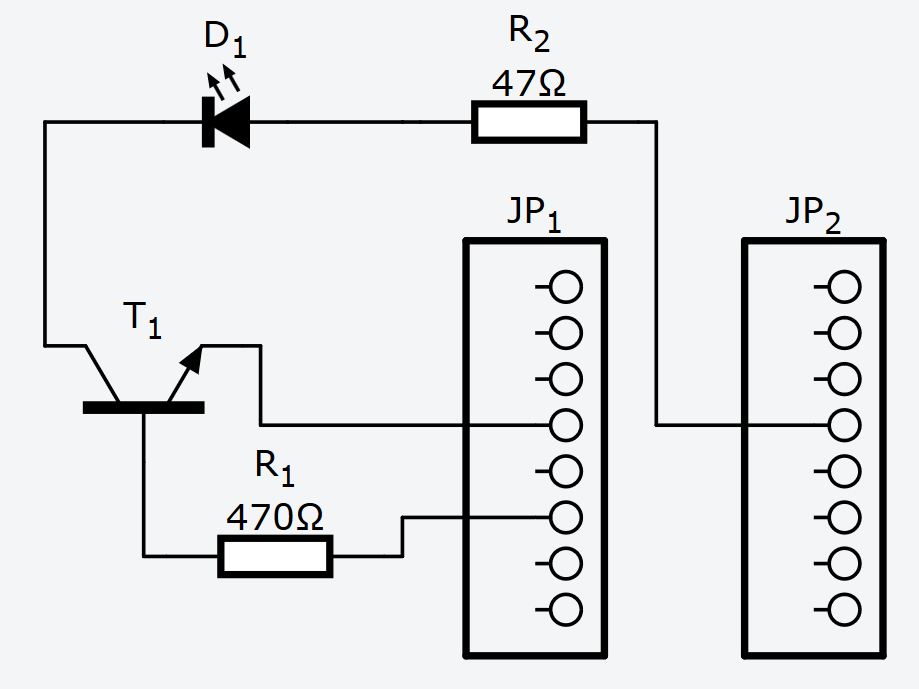

# Infrared Shield for Arduino Nano
Arduino Nano shield for infrared transmission

# Important notice
Infrared LED curent is limited to ~80mA and setting D3 pin to HIGH for longer time may destroy the LED.

# BOM
- 1x resistor 470ohm
- 1x resistor 47ohm
- 1x transistor 2N2222
- 1x infrared LED
- 2x female pin row 1x6 or longer
- 1x universal PCB (2.54mm hole pitch)

# Schematic

# Applications
- Virtual wall for iRobot Roomba
